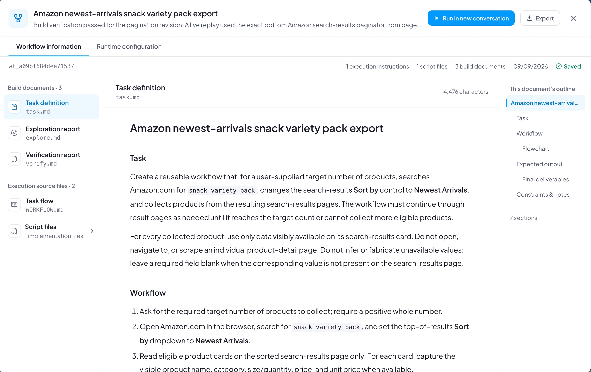

# 【教程】自动采集天猫超市商品信息

本教程介绍如何使用Bridgic Agent构建自动化工作流，从天猫超市抓取某一类的商品信息（包括自动化获取商品图片），批量存入excel文件中。
本教程详细记录了该工作流的构建过程和运行过程。

下面我们马上开始探索之旅！在这个过程中，你无需关注任何一行底层代码。

## 成品展示

在本教程结束后，你将会看到一个成功构建的工作流：

该工作流可直接下载并导入进你的Bridgic Agent，作为参考：
<!-- 写成 HTML 而非 markdown 链接的原因见 project-management-automation.md 同一处。 -->
<ul>
<li><a href="/downloads/tmall-snack-scraper.amphi-workflow" download>天猫超市休闲零食商品列表采集并导出 Excel</a></li>
</ul>

**注意**：由于每个人的电脑桌面运行环境不同，这个工作流未必能在导入后直接运行。仅作为参考，你可以参考它们制作自己真正需要的工作流。
如果你一定要运行这个工作流，可以在运行碰到问题后，要求Bridgic Agent根据你的实际运行环境修复它即可。

你还会看到，运行该工作后产出的excel文件（里面存放着从天猫超市采集到的商品信息列表）：

## 工作流构建教程

### 准备工作

请提前准备好你在天猫超市的账号，用于帮助agent登录。

### 构建可复用的工作流

本节会引导你创建出一个可复用（可重跑）的自动化工作流。

使用“/build”命令开始工作流创建。简洁、准确地描述需求：

Bridgic Agent对于需求中不明确的描述会主动和你确认（需求澄清）：

Bridgic Agent会提示你选择或确认任务的验收标准：

这里来到了很关键的一步：**任务说明书的确认**！你需要仔细阅读这里的描述，确保工作流的描述符合你的需求。如果你发现不符合需求的地方，可以用鼠标选中相应文字并评论它，然后Bridgic Agent会根据你的评论进行相应的修改。

请关注任务说明书中对于“最终交付物”和“验收标准”的描述。

至此任务说明书已经确认。接下来请遵照Bridgic Agent的引导进行操作。

Bridgic Agent发现天猫超市需要用户登录，所以弹框告知用户来处理：

**先不要点击上面这个弹框**。先在右侧浏览器中完成登录（输入账号名和密码，或者用淘宝App扫描二维码）：

现在可以回到对话中提交前面的登录提示弹框了！

Bridgic Agent在运行过程中又发现了一个需求澄清的点：

需求澄清后，Bridgic Agent会引导你第二次确认任务说明书的变动：

构建工作流的最后一步：给工作流取个名字。

工作流创建成功！

这个新创建的工作流，以后你随时可以在工作流页面中找到它。工作流卡片如下：

### 运行工作流

点击“查看结果”，可以看到刚才工作流的运行结果：

可以把最后的excel表格下载出来，里面存放着从天猫超市采集到的商品信息列表（该示例批次为50个商品）：

### 调度工作流

如果需要定期采集，可以使用Bridgic Agent提供的“调度”功能，来设置定时执行。此处略。

## 注意事项

- 由于电脑本地的执行环境不同，你的构建过程可能也会碰到很多差异，未必跟以上记录的过程完全相同。具体的过程体验取决于环境和模型能力；建议使用好的模型来构建工作流，然后可以使用次一级的模型来运行它。
- 工作流构建出来之后，并非一成不变，Bridgic Agent提供了强大的工作流修改能力。如果你需求有所变动，随时告诉Bridgic Agent：“修改 @XXX工作流，我要XXXX”。你可以不断优化自己的工作流，让它越来越精细，也越来越贴近你的需求。
- Bridgic Agent对于工作流的构建，成功率非常高。只要需求描述清晰且可行，通常能够一次性成功。但偶尔出现失败的情况，也不要紧，可以让Bridgic Agent修复工作流。修复时告诉它你碰到的异常情况。
- 构建过程中如果发生意外情况，不要慌张，可以随时向agent提问，请它提供更多信息或者让它给建议。在中间过程可以把碰到的问题/疑问都抛给Bridgic Agent。
