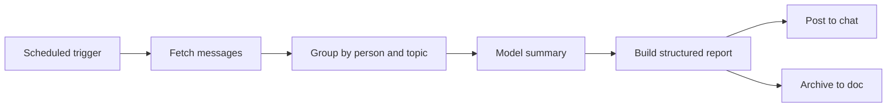

# Feishu daily report generator

Summarize team Feishu messages into a structured daily report and post it back to the group.

::: tip When to use it
Teams spread across several groups where message volume is high but conclusions are scarce. It replaces "someone reads the backlog every evening and writes a summary".
:::

## Flow



## Steps

1. **Trigger** — fires at a fixed time on weekdays
2. **Fetch** — messages in the window for the configured chats, including thread replies
3. **Group** — by author and topic, dropping reactions and attachment-only noise
4. **Summarize** — the model extracts progress, blockers and pending decisions
5. **Publish** — post the report back and archive a copy

## Options

| Option | Description | Default |
|---|---|---|
| `chat_ids` | Chats to summarize | required |
| `window` | Time window | `24h` |
| `schedule` | Trigger time (cron) | `0 19 * * 1-5` |
| `sections` | Report sections | `Progress,Blockers,Decisions` |
| `archive_doc` | Archive destination | optional |

## Output

```json
{
  "date": "2026-08-11",
  "sections": {
    "Progress": ["Integration testing done, entering regression", "Mobile at 10% rollout"],
    "Blockers": ["Payment callback certificate still awaiting approval"],
    "Decisions": ["Whether to freeze scope this week"]
  },
  "message_count": 342,
  "participants": 11
}
```

::: warning Permissions first
The bot must already be a member of each target chat **and** hold read-history permission. With send-only permission the fetch returns nothing.
:::
