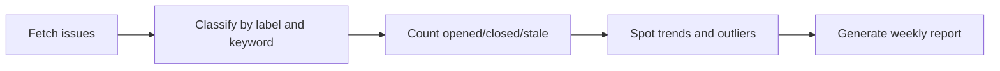

# GitHub Issue analysis

Analyze repository Issue trends and produce a weekly report.

::: tip When to use it
Repositories where the Issue volume has passed "readable". It answers *where problems are clustering this week* — it does not triage individual issues for you.
:::

## Flow



## Steps

1. **Fetch** — issues in range with comment counts, labels and state
2. **Classify** — combine existing labels with title keywords into problem domains
3. **Count** — opened, closed, net, and stale (no response for N days)
4. **Spot outliers** — a domain suddenly spiking, or close rate falling off
5. **Report** — as Markdown, or pushed to a chat

## Options

| Option | Description | Default |
|---|---|---|
| `repos` | Repositories, `owner/name` | required |
| `range` | Reporting window | `7d` |
| `stale_days` | Days without response to count as stale | `14` |
| `group_by` | Grouping: `label` \| `keyword` \| `both` | `both` |

## Output

```json
{
  "range": "2026-08-05..2026-08-11",
  "opened": 47,
  "closed": 39,
  "net": 8,
  "stale": 23,
  "top_domains": [
    { "domain": "Install and environment", "count": 14, "trend": "+180%" },
    { "domain": "API compatibility", "count": 9, "trend": "-10%" }
  ]
}
```

::: warning Rate limits
Unauthenticated requests get 60 per hour, which a large repository exhausts almost immediately. Configure a token — authenticated requests get 5,000 per hour.
:::
