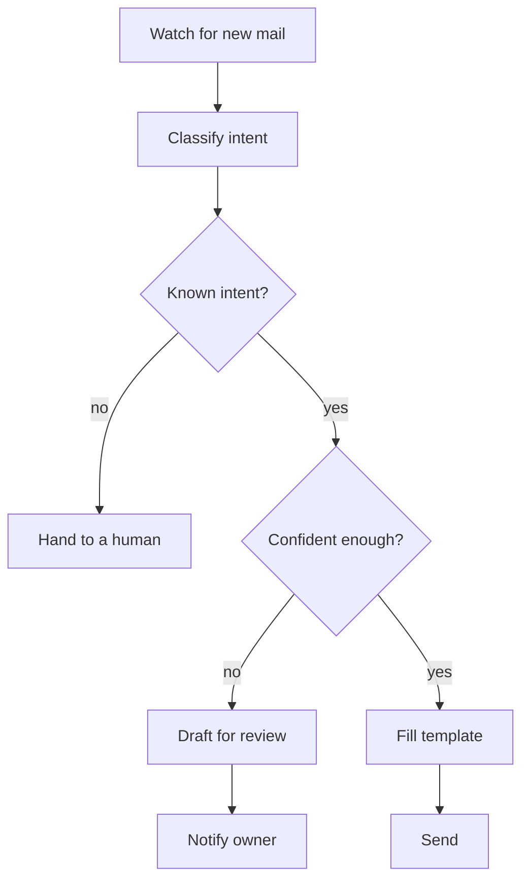

# Automatic email replies

Automatically classify and reply to common emails based on rules.

::: tip When to use it
Inboxes where the same few questions dominate: support enquiries, signup confirmations, requests for materials. **Not** for anything involving commitments, quotes or contracts.
:::

## Flow



## Steps

1. **Watch** — subscribe to new-mail events, or poll on an interval
2. **Classify** — determine intent with a confidence score
3. **Route** — high confidence auto-replies; low confidence drafts; unknown goes to a human
4. **Generate** — fill the matching template
5. **Record** — log the outcome and the reason for every message

## Options

| Option | Description | Default |
|---|---|---|
| `intents` | Intent-to-template mapping | required |
| `auto_send_threshold` | Confidence required to send automatically | `0.9` |
| `allowlist` | Sender domains eligible for auto-reply | empty (everything drafts) |
| `signature` | Reply signature | optional |
| `quiet_hours` | No automatic sending during this window | `22:00-08:00` |

## Disposition record

```json
{
  "message_id": "<CAF=8a91@mail.example.com>",
  "intent": "materials_request",
  "confidence": 0.94,
  "action": "auto_sent",
  "template": "materials_v3",
  "handled_at": "2026-08-11T09:12:44+08:00"
}
```

::: warning Conservative by default
`allowlist` is empty by default, meaning **nothing is sent automatically — everything becomes a draft**. That is deliberate: the cost of one wrong email going out is far higher than the cost of a human confirming once. Open up domains gradually, once the rules have proven stable.
:::
