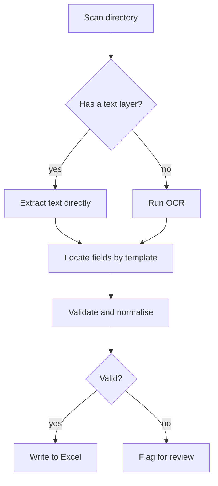

# PDF batch extractor

Extract structured data from multiple PDFs into Excel.

::: tip When to use it
Documents with a **fairly fixed** layout: invoices, customs forms, lab reports, statements. Free-form documents need layout analysis first, which costs far more.
:::

## Flow



## Steps

1. **Scan** — walk the directory, filtering by extension
2. **Split** — text-layer PDFs are extracted directly; scans go through OCR
3. **Locate fields** — by template: a keyword anchor plus a relative position
4. **Validate** — check amount, date and tax-id formats; normalise units
5. **Write out** — one row per document, invalid rows flagged separately

## Options

| Option | Description | Default |
|---|---|---|
| `input_dir` | Input directory | required |
| `template` | Field template name | required |
| `ocr` | OCR when no text layer exists | `true` |
| `output` | Output Excel path | `./out.xlsx` |
| `on_invalid` | On validation failure: `flag` \| `skip` | `flag` |

## Field template

```yaml
fields:
  - name: invoice_no
    anchor: Invoice No.
    offset: right
    pattern: '^\d{8,20}$'
  - name: amount
    anchor: Total
    offset: right
    type: currency
```

::: warning The limits of OCR accuracy
On scans, digit errors cluster on `0/O`, `1/l` and `5/S`. Always enable format validation for amount fields, and keep a link to the source image on flagged rows — silently recording a wrong number is far more dangerous than failing loudly.
:::
