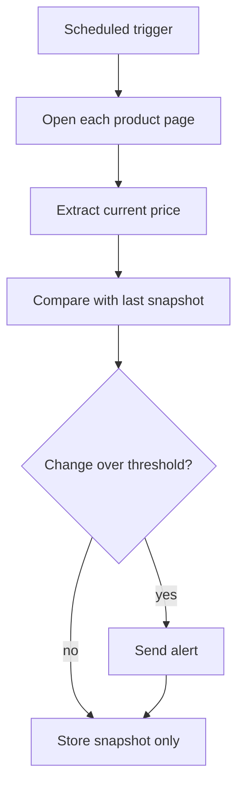

# Competitor price monitor

Monitor competitor-site prices and send alerts when they change.

::: tip When to use it
Tens to a few hundred SKUs on pages with stable markup. Past a thousand SKUs, prefer an official API or a data vendor.
:::

## Flow



## Steps

1. **Load list** — read the product URLs to watch
2. **Extract** — read the price, handling both sale and struck-through prices
3. **Compare** — diff against the previous snapshot and compute the delta
4. **Alert** — push to Feishu or email once the threshold is crossed
5. **Record** — always store a snapshot, alert or not, so the trend stays auditable

## Options

| Option | Description | Default |
|---|---|---|
| `urls` | Product page URLs | required |
| `selector` | Price element selector | auto-detected |
| `threshold` | Relative change that triggers an alert | `0.05` |
| `schedule` | Check frequency | `0 */6 * * *` |
| `notify` | Alert channel | `feishu` |

## Snapshot

```json
{
  "url": "https://example.com/p/1001",
  "price": 299.0,
  "currency": "CNY",
  "previous": 329.0,
  "change": -0.0912,
  "checked_at": "2026-08-11T06:00:00+08:00"
}
```

::: warning Where price extraction breaks
Sale periods insert extra price elements — list price, final price, price-after-coupon. Auto-detection picks the primary displayed price; during big sales, set `selector` explicitly and spot-check the results.
:::
