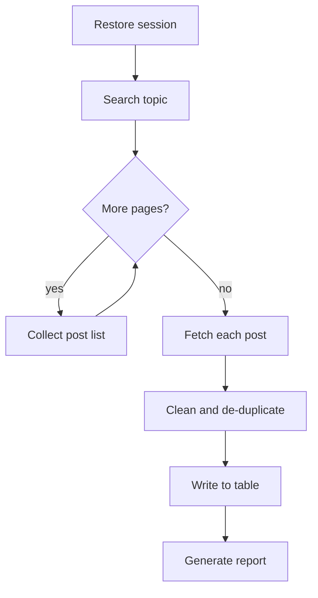

# Xiaohongshu content scraper

Automatically collect posts and engagement data for selected Xiaohongshu topics, into a table you can analyse directly.

::: tip When to use it
Topic research, competitor account monitoring, working out what makes a post land. The payoff is largest when you need to track a topic **continuously** — a one-off survey is faster by hand.
:::

## Flow



## Steps

1. **Restore session** — reuse a saved browser session instead of scanning a QR code every run
2. **Search topic** — open the topic page, ordered by *hot* or *latest*
3. **Paginate** — scroll-load until the limit is reached or nothing new arrives
4. **Fetch details** — open each post for its body, images and like/save/comment counts
5. **Clean** — de-duplicate by post id, drop ads and dead entries
6. **Write out** — Excel or a Feishu Bitable

## Options

| Option | Description | Default |
|---|---|---|
| `topic` | Topic keywords; multiple allowed | required |
| `limit` | Max posts per topic | `50` |
| `sort` | Ordering: `hot` \| `latest` | `hot` |
| `interval_ms` | Delay between requests, to stay under rate control | `1500` |
| `output` | Destination: `excel` \| `bitable` | `excel` |

## Output

::: code-group

```json [single post]
{
  "note_id": "65f2c1a8000000001203b4d7",
  "title": "Commute outfits shot in three days",
  "author": "zhang",
  "likes": 12483,
  "collects": 3120,
  "comments": 486,
  "published_at": "2026-08-09T10:24:00+08:00",
  "images": 9
}
```

```csv [rollup]
note_id,title,author,likes,collects,comments
65f2c1a8...,Commute outfits shot in three days,zhang,12483,3120,486
```

:::

## Rate and risk control

Faster is not better here. The binding constraint is account risk, not bandwidth:

- Below an 800ms interval, the chance of hitting a captcha rises sharply[^1]
- Keep a single account under roughly 2,000 posts per day
- After a rate-control hit, **do not retry** — switch session or wait it out

[^1]: Threshold from long-run internal observation. Platform policy changes, so treat it as a starting point, not a guarantee.

::: warning Compliance
Collect only publicly visible content and do not work around any access control. Personal data you collect remains subject to local privacy law and must not be redistributed.
:::

::: details Common failures
**Stuck on the search page** — the session expired; restore it again.

**Zero results** — the topic page markup changed and selectors need updating. Run with `--headed` and look at what actually renders.

**All counts are zero** — engagement numbers load lazily and the wait was too short; raise `interval_ms`.
:::
