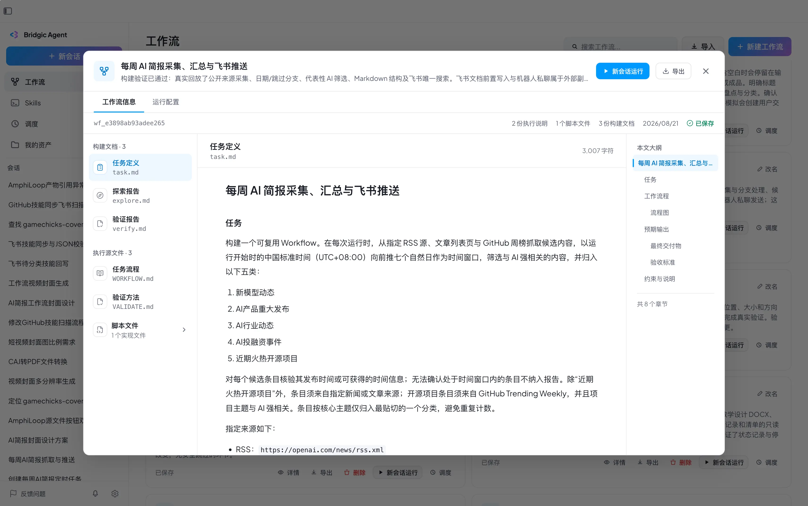
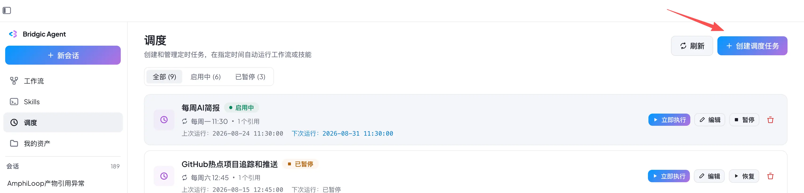
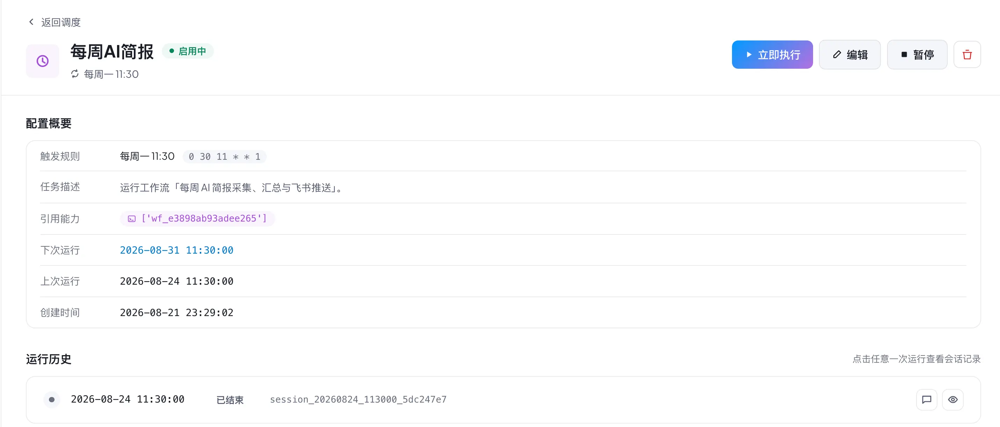

# 【教程】每周自动推送AI简报

本教程介绍如何使用Bridgic Agent给自己定制一份AI简报推送。本教程推送的AI简报内容包括，新模型动态、AI产品重大发布、AI行业动态、AI投融资事件，以及近期火热的开源项目。当然，关键的是你可以随时对这个自动化工作流进行修改，根据自己的需求增减数据源、报告格式或推送频率等等。

下面我们马上开始探索之旅！在这个过程中，你无需关注任何一行底层代码。

## 成品展示

在本教程结束后，你将会看到一个成功构建的工作流：

该工作流可直接下载并导入进你的Bridgic Agent，作为参考：
<!-- 写成 HTML 而非 markdown 链接的原因见 project-management-automation.md 同一处。 -->
<ul>
<li><a href="/downloads/ai-trending-report.amphi-workflow" download>每周 AI 简报采集、汇总与飞书推送</a></li>
</ul>

**注意**：由于每个人的电脑桌面运行环境不同，这个工作流未必能在导入后直接运行。仅作为参考，你可以参考它们制作自己真正需要的工作流。
如果你一定要运行这个工作流，可以在运行碰到问题后，要求Bridgic Agent根据你的实际运行环境修复它即可。

## 工作流构建和运行

准备你自己的飞书账号，创建出一个飞书云文档，用于工作流把AI简报写入这个文档。

请观看视频学习这个工作里的构建和运行过程。

<EmbedVideo bvid="BV1Uk8x6eEk6" />

### 定时调度运行

## 注意事项

- 由于电脑本地的执行环境不同，你的构建过程可能也会碰到很多差异，未必跟以上记录的过程完全相同。具体的过程体验取决于环境和模型能力；建议使用好的模型来构建工作流，然后可以使用次一级的模型来运行它。
- 工作流构建出来之后，并非一成不变，Bridgic Agent提供了强大的工作流修改能力。如果你需求有所变动，随时告诉Bridgic Agent：“修改 @XXX工作流，我要XXXX”。你可以不断优化自己的工作流，让它越来越精细，也越来越贴近你的需求。
- Bridgic Agent对于工作流的构建，成功率非常高。只要需求描述清晰且可行，通常能够一次性成功。但偶尔出现失败的情况，也不要紧，可以让Bridgic Agent修复工作流。修复时告诉它你碰到的异常情况。
- 构建过程中如果发生意外情况，不要慌张，可以随时向agent提问，请它提供更多信息或者让它给建议。在中间过程可以把碰到的问题/疑问都抛给Bridgic Agent。
