# 【教程】自动采集天猫超市商品信息 (WIP)

本教程介绍如何使用Bridgic Agent构建自动化工作流，从天猫超市抓取某一类的商品信息，包括自动化获取商品图片。
本教程详细记录了该工作流的构建过程和运行过程。

## 成品展示

## 工作流构建教程

### 准备工作

请提前准备好你在天猫超市的账号，用于帮助agent登录。

### 构建可复用的工作流

先创建第一个可复用（可重跑）的自动化工作流。

使用“/build”命令开始工作流创建。简洁、准确地描述需求：

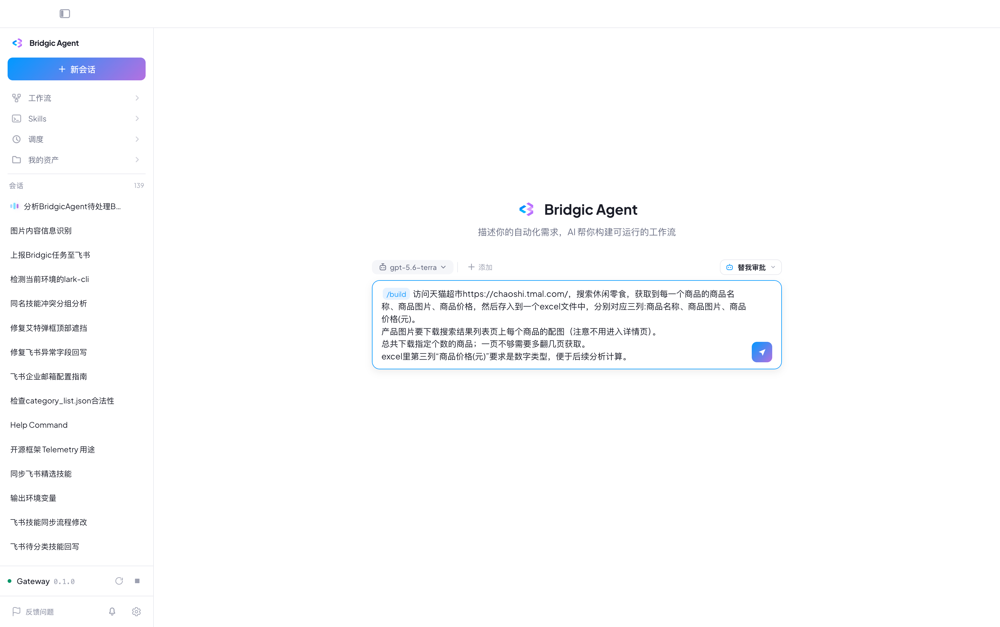

Brdgic Agent对于需求中不明确的描述会主动和你确认（需求澄清）：

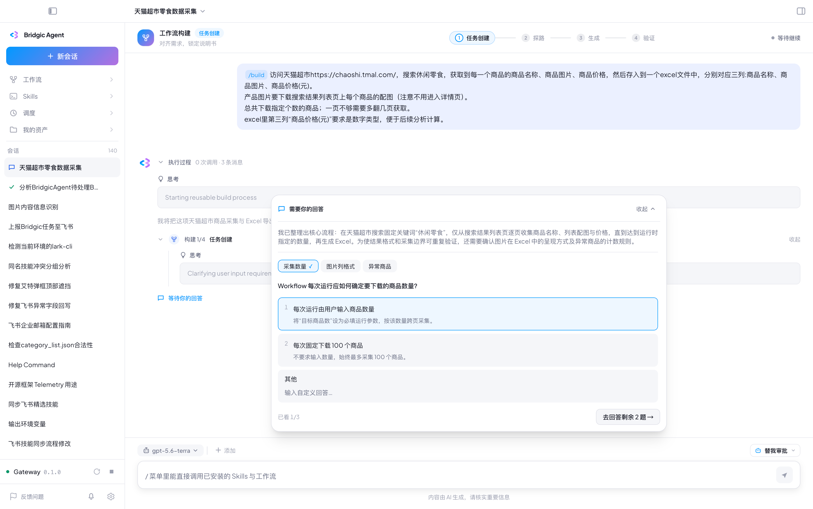

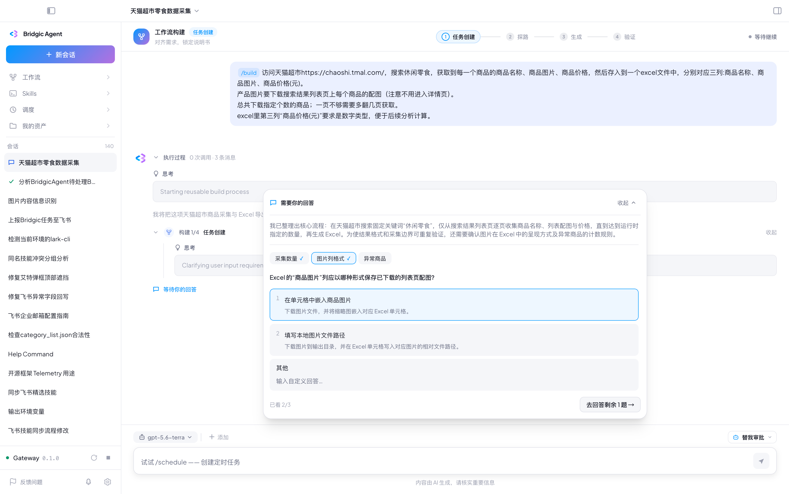

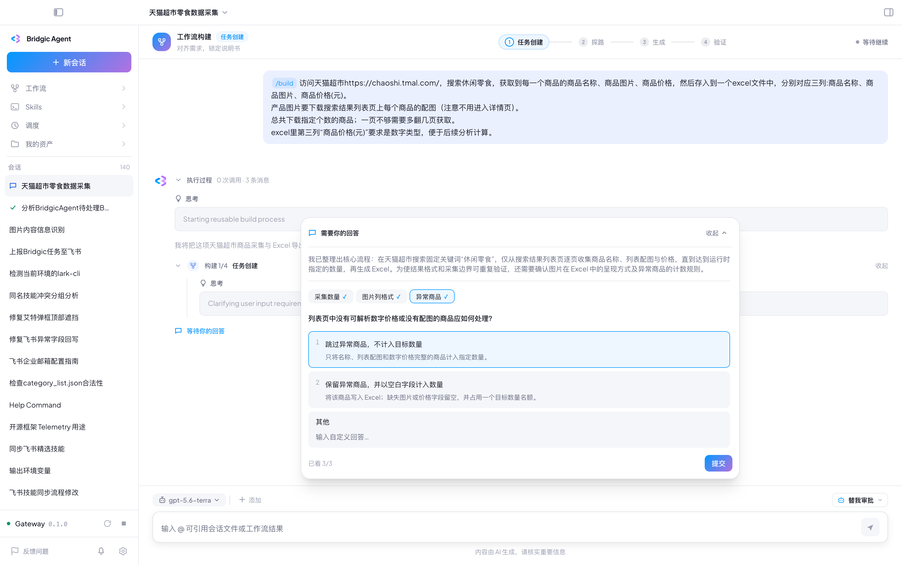

Brdgic Agent会提示你选择或确认任务的验收标准：

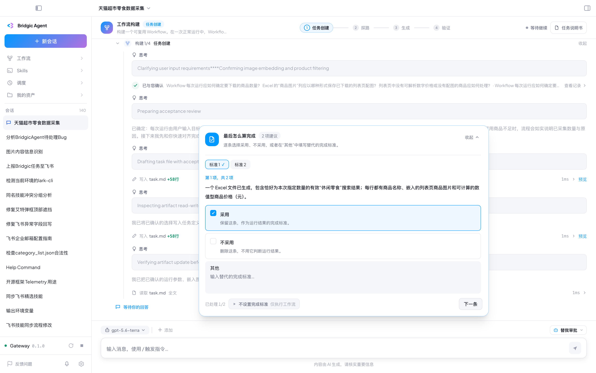

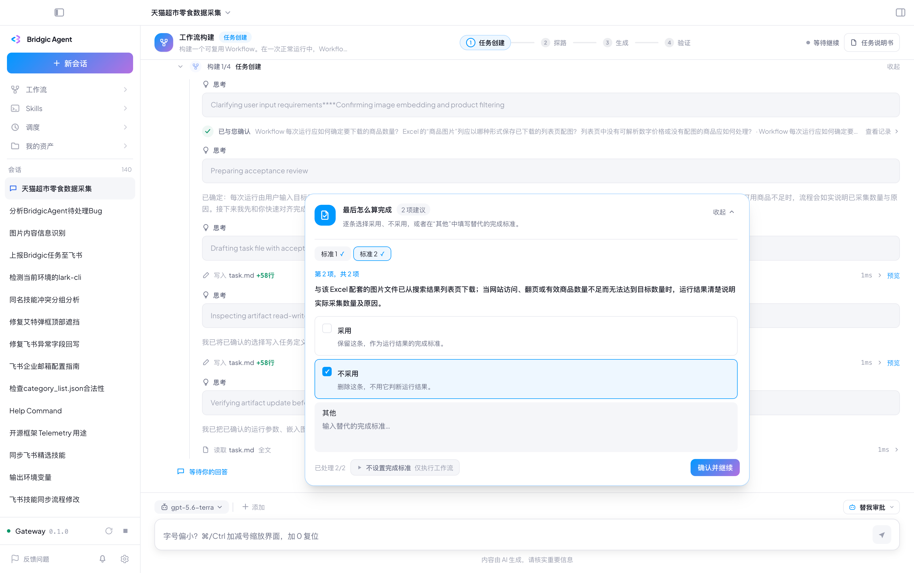

这里来到了很关键的一步：**任务说明书的确认**！你需要仔细阅读这里的描述，确保工作流的描述符合你的需求。如果你发现不符合需求的地方，可以用鼠标选中相应文字并评论它，然后Brdgic Agent会根据你的评论进行相应的修改。

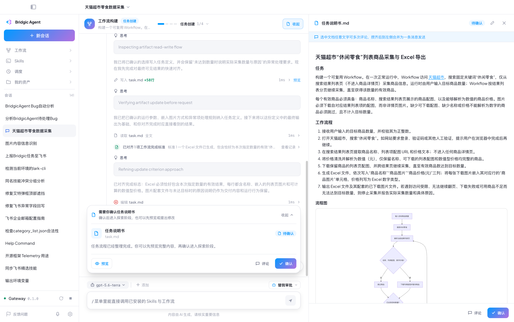

请关注任务说明书中对于“最终交付物”和“验收标准”的描述。

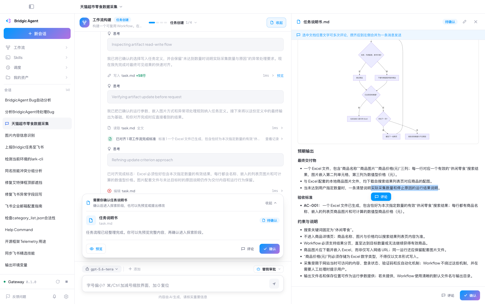

至此任务说明书已经确认。接下来请遵照Brdgic Agent的引导进行操作。

Bridgic Agent发现天猫超市需要用户登录，所以弹框告知用户来处理：

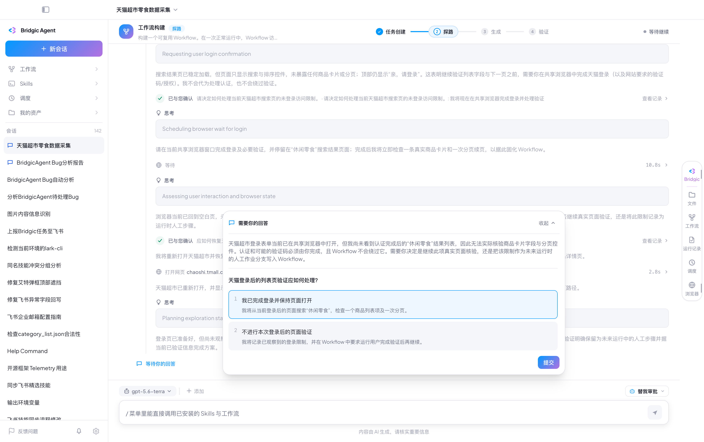

**先不要点击上面这个弹框**。先在右侧浏览器中完成登录（输入账号名和密码，或者用淘宝App扫描二维码）：

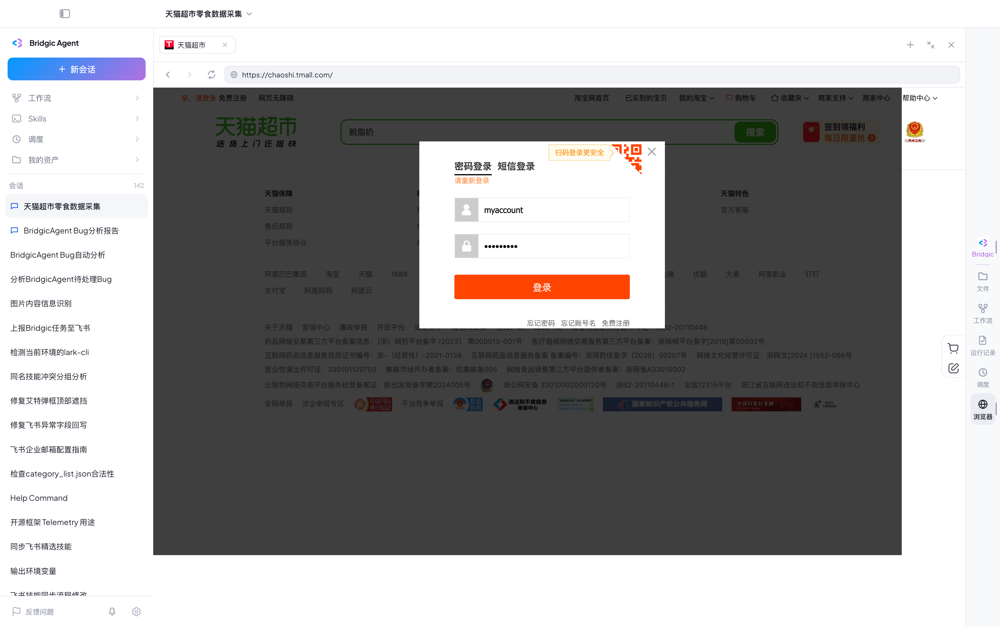

现在可以回到对话中提交前面的登录提示弹框了！

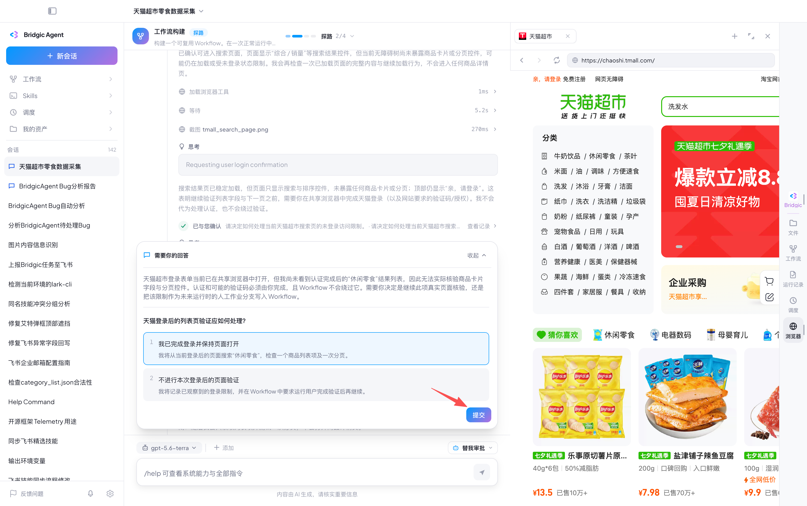

### 运行工作流

### 调度工作流

## 注意事项

修改工作流
