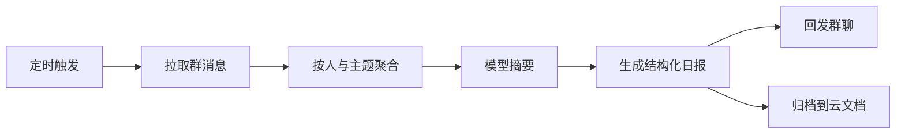

# 飞书日报生成器

每日自动汇总团队飞书消息，生成结构化日报并回发到群。

::: tip 适用场景
成员分散在多个群、信息密度高但结论少的团队。它替代的是「每天有人手工翻聊天记录写总结」。
:::

## 流程



## 步骤

1. **定时触发** —— 每工作日固定时间启动
2. **拉取消息** —— 按时间窗口取指定群的消息，含话题群子话题
3. **聚合** —— 按发言人和主题归类，剔除表情、纯附件等噪声
4. **摘要** —— 模型抽取进展、阻塞、待决策三类信息
5. **产出** —— 生成日报并回发群，同时归档到云文档

## 配置项

| 参数 | 说明 | 默认值 |
|---|---|---|
| `chat_ids` | 要汇总的群列表 | 必填 |
| `window` | 时间窗口 | `24h` |
| `schedule` | 触发时间（cron） | `0 19 * * 1-5` |
| `sections` | 日报分节 | `进展,阻塞,待决策` |
| `archive_doc` | 归档目标文档 | 可选 |

## 输出结构

```json
{
  "date": "2026-08-11",
  "sections": {
    "进展": ["接口联调完成，进入回归", "移动端灰度 10%"],
    "阻塞": ["支付回调证书仍在等审批"],
    "待决策": ["是否本周冻结需求"]
  },
  "message_count": 342,
  "participants": 11
}
```

::: warning 权限前提
机器人必须已在目标群内，且具备读取历史消息的权限。仅有发消息权限时会拉到空结果。
:::
