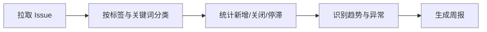

# GitHub Issue 分析

自动分析仓库 Issue 趋势，生成周报。

::: tip 适用场景
Issue 量达到「看不完」的开源或内部仓库。它回答的是「这周问题集中在哪」，而不是替你处理具体 Issue。
:::

## 流程



## 步骤

1. **拉取** —— 按时间范围取 Issue 与其评论数、标签、状态
2. **分类** —— 结合已有标签和标题关键词归类到问题域
3. **统计** —— 新增、关闭、净增、停滞（超过 N 天无响应）
4. **识别异常** —— 某一类突然放量、关闭率骤降
5. **产出周报** —— Markdown 或推送到群

## 配置项

| 参数 | 说明 | 默认值 |
|---|---|---|
| `repos` | 仓库列表，`owner/name` | 必填 |
| `range` | 统计区间 | `7d` |
| `stale_days` | 判定停滞的天数 | `14` |
| `group_by` | 分类维度：`label` \| `keyword` \| `both` | `both` |

## 输出示例

```json
{
  "range": "2026-08-05..2026-08-11",
  "opened": 47,
  "closed": 39,
  "net": 8,
  "stale": 23,
  "top_domains": [
    { "domain": "安装与环境", "count": 14, "trend": "+180%" },
    { "domain": "接口兼容", "count": 9, "trend": "-10%" }
  ]
}
```

::: warning 速率限制
未认证请求每小时 60 次，很容易在大仓库上耗尽。务必配置 token，认证后为 5000 次/小时。
:::
