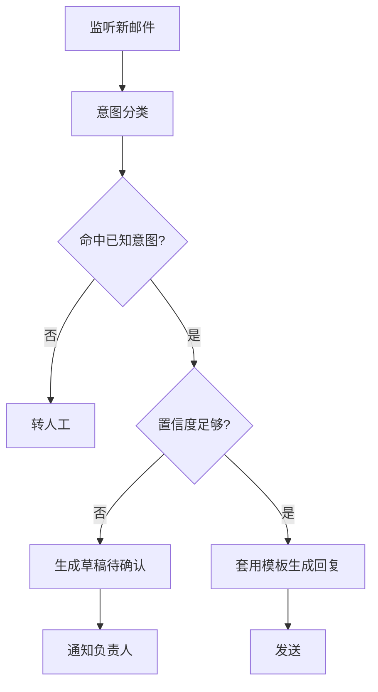

# 邮件自动回复

根据规则自动分类和回复常见邮件。

::: tip 适用场景
重复问法高度集中的收件箱：售后咨询、报名确认、资料索取。**不适合**需要承诺、报价、涉及合同的往来。
:::

## 流程



## 步骤

1. **监听** —— 订阅新邮件事件，或按间隔轮询
2. **分类** —— 判定意图并给出置信度
3. **分流** —— 高置信度自动回复；低置信度生成草稿；未命中转人工
4. **生成** —— 套用模板并填充变量
5. **留痕** —— 记录每封邮件的处置结果与依据

## 配置项

| 参数 | 说明 | 默认值 |
|---|---|---|
| `intents` | 意图与模板映射 | 必填 |
| `auto_send_threshold` | 自动发送的置信度门槛 | `0.9` |
| `allowlist` | 允许自动回复的发件域 | 空（全部走草稿） |
| `signature` | 回复签名 | 可选 |
| `quiet_hours` | 静默时段不自动发送 | `22:00-08:00` |

## 处置记录

```json
{
  "message_id": "<CAF=8a91@mail.example.com>",
  "intent": "资料索取",
  "confidence": 0.94,
  "action": "auto_sent",
  "template": "materials_v3",
  "handled_at": "2026-08-11T09:12:44+08:00"
}
```

::: warning 默认保守
`allowlist` 默认为空，也就是**默认只生成草稿不自动发送**。这是刻意的：自动发错一封邮件的代价，远高于人工确认一次的成本。确认规则稳定后再逐步放开域名。
:::
