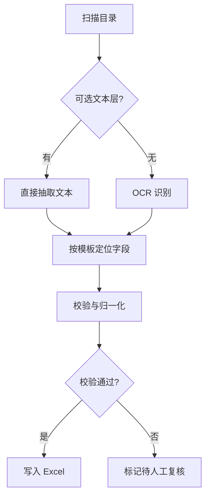

# PDF 批量提取器

从多个 PDF 中提取结构化数据到 Excel。

::: tip 适用场景
版式**相对固定**的批量文档：发票、报关单、体检报告、对账单。版式完全自由的文档需要先做版面分析，成本高得多。
:::

## 流程



## 步骤

1. **扫描** —— 递归遍历目录，按扩展名过滤
2. **分流** —— 有文本层的直接抽取，扫描件走 OCR
3. **定位字段** —— 按模板（关键字锚点 + 相对位置）取值
4. **校验归一** —— 金额、日期、税号格式校验，单位统一
5. **落表** —— 一行一文档，校验失败的单独标记

## 配置项

| 参数 | 说明 | 默认值 |
|---|---|---|
| `input_dir` | 输入目录 | 必填 |
| `template` | 字段模板名 | 必填 |
| `ocr` | 无文本层时是否 OCR | `true` |
| `output` | 输出 Excel 路径 | `./out.xlsx` |
| `on_invalid` | 校验失败处理：`flag` \| `skip` | `flag` |

## 字段模板

```yaml
fields:
  - name: invoice_no
    anchor: 发票号码
    offset: right
    pattern: '^\d{8,20}$'
  - name: amount
    anchor: 价税合计
    offset: right
    type: currency
```

::: warning OCR 的准确率边界
扫描件的数字识别错误主要集中在 `0/O`、`1/l`、`5/S`。金额字段务必开启格式校验，并对校验失败的行保留原图链接以便复核 —— 静默取错值比报错危险得多。
:::
