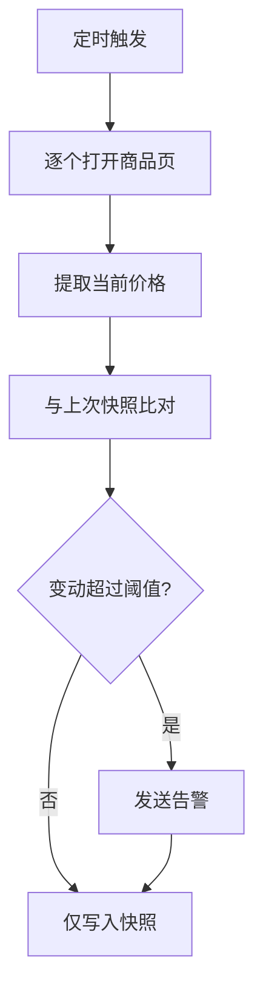

# 竞品价格监控

定时监控竞品网站价格变动并发送告警。

::: tip 适用场景
SKU 数量在几十到几百、竞品页面结构稳定的场景。上千 SKU 建议改用官方接口或数据服务。
:::

## 流程



## 步骤

1. **加载清单** —— 读取待监控的商品 URL 列表
2. **提取价格** —— 按选择器取价，兼容促销价与划线价
3. **比对** —— 与上一次快照对比，计算变动幅度
4. **告警** —— 超过阈值时推送到飞书或邮件
5. **留痕** —— 无论是否告警都写入快照，便于回溯趋势

## 配置项

| 参数 | 说明 | 默认值 |
|---|---|---|
| `urls` | 商品页地址列表 | 必填 |
| `selector` | 价格元素选择器 | 自动探测 |
| `threshold` | 触发告警的变动比例 | `0.05` |
| `schedule` | 检查频率 | `0 */6 * * *` |
| `notify` | 告警渠道 | `feishu` |

## 快照格式

```json
{
  "url": "https://example.com/p/1001",
  "price": 299.0,
  "currency": "CNY",
  "previous": 329.0,
  "change": -0.0912,
  "checked_at": "2026-08-11T06:00:00+08:00"
}
```

::: warning 价格提取的脆弱点
促销期页面常会插入额外的价格元素（划线价、到手价、券后价）。自动探测取的是「主展示价」，大促期间建议显式指定 `selector` 并抽查核对。
:::
