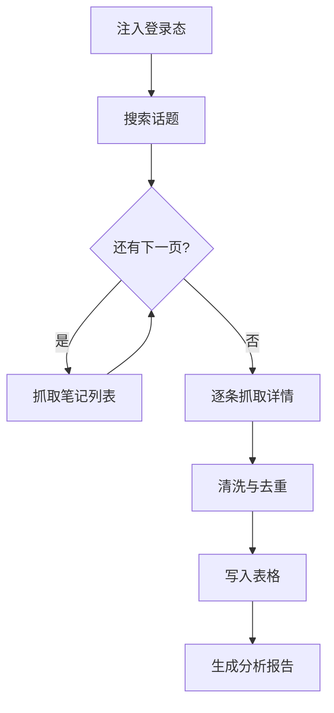

# 小红书内容爬虫

自动抓取小红书指定话题的笔记内容和互动数据，产出可直接分析的结构化表格。

::: tip 适用场景
内容选题调研、竞品账号监控、爆款要素归因。需要**持续**追踪某个话题时收益最大 —— 一次性调研手工做更快。
:::

## 流程



## 步骤

1. **注入登录态** —— 复用已保存的浏览器会话，避免每次扫码
2. **搜索话题** —— 按关键词进入话题页，按「最热」或「最新」排序
3. **翻页采集** —— 滚动加载，直到达到设定数量或没有新内容
4. **抓取详情** —— 进入每条笔记，取正文、图片、点赞/收藏/评论数
5. **清洗去重** —— 按笔记 ID 去重，过滤广告与失效内容
6. **落表** —— 写入 Excel 或飞书多维表格

## 配置项

| 参数 | 说明 | 默认值 |
|---|---|---|
| `topic` | 话题关键词，支持多个 | 必填 |
| `limit` | 每个话题最多抓取条数 | `50` |
| `sort` | 排序方式：`hot` \| `latest` | `hot` |
| `interval_ms` | 请求间隔，防触发风控 | `1500` |
| `output` | 输出目标：`excel` \| `bitable` | `excel` |

## 输出示例

::: code-group

```json [单条笔记]
{
  "note_id": "65f2c1a8000000001203b4d7",
  "title": "三天出片的通勤穿搭",
  "author": "小张同学",
  "likes": 12483,
  "collects": 3120,
  "comments": 486,
  "published_at": "2026-08-09T10:24:00+08:00",
  "images": 9
}
```

```csv [汇总表]
note_id,title,author,likes,collects,comments
65f2c1a8...,三天出片的通勤穿搭,小张同学,12483,3120,486
```

:::

## 频率与风控

采集速率不是越快越好。实际约束是账号风险，而非带宽：

- 请求间隔低于 800ms 时，触发验证码的概率显著上升[^1]
- 单账号单日采集量建议控制在 2000 条以内
- 命中风控后**不要重试**，换会话或等待冷却

[^1]: 该阈值来自内部长期观测，平台策略会调整，请以实际表现为准。

::: warning 合规提醒
仅采集公开可见内容，不要绕过任何访问控制。采集到的用户数据须遵循当地个人信息保护法规，不得二次分发。
:::

::: details 常见失败与排查
**卡在搜索页** —— 登录态过期，重新注入会话。

**抓到 0 条** —— 话题页结构变更，需要更新选择器。用 `--headed` 模式肉眼确认页面实际渲染。

**数字全为 0** —— 互动数据是懒加载的，等待时间不足，调大 `interval_ms`。
:::
